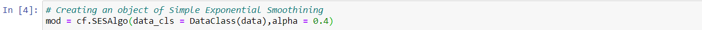

<!-- TABLE OF CONTENTS -->
<details open="open">
  <summary>Table of Contents</summary>
  <ol>
    <li>
      <a href="#demand_forecast">Demand_Forecast</a>
      <ul>
        <li><a href="#introduction">Introduction</a></li>
      </ul>
    </li>
    <li>
      <a href="#data-preparation">Data Preparation</a>
      <ul>
        <li><a href="#installation">Installation</a></li>
      </ul>
    </li>
    <li>
      <a href="#data-class">Data Class</a>
      <ul>
        <li><a href="#parameters">Parameters</a></li>
        <li><a href="#methods">Methods</a></li>
      </ul>
    </li>
    <li>
      <a href="#simple-exponential-smoothing">Simple Exponential smoothing</a>
      <ul>
        <li><a href="#parameters">Parameters</a></li>
        <li><a href="#methods">Methods</a></li>
        <li><a href="#example">Example</a></li>
      </ul>
    </li>
    <li>
      <a href="#sarimax">Sarimax</a>
      <ul>
        <li><a href="#parameters">Parameters</a></li>
        <li><a href="#methods">Methods</a></li>
        <li><a href="#example">Example</a></li>
      </ul>
    </li>
    <li>
      <a href="#lightgbmregressor">LightGBMRegressor</a>
      <ul>
        <li><a href="#parameters">Parameters</a></li>
        <li><a href="#methods">Methods</a></li>
        <li><a href="#example">Example</a></li>
      </ul>
    </li>
  </ol>
</details>

<!-- Demand_Forecast -->
## Demand_Forecast
### Introduction
A time series is a sequence of observations over a certain period. The simplest example
of a time series that all of us come across on a day to day basis is the change in
temperature throughout the day or week or month or year.
The analysis of temporal data is capable of giving us useful insights on how a variable
changes over time.
This module will help you with various statistical and machine learning model to analyze and forecast time series data

<!-- DATA PREPARATION -->
## Data Preparation

To fit most of the models covered by Demand_Forecast. You will need to prepare data that should have endogenous variable(s) ‘y' (i.e. dependent, response, regressand, etc.). The second variable 'ds’  as time variant (weekly/daily/hourly/minutes/seconds) and exogenous variable(s) (i.e. independent, predictor, regressor, etc.)


### Installation
To get a local copy up and running follow these simple steps.

1. Clone the repo
   ```sh
   git clone https://github.com/github_username/repo_name.git
   ```
2. Install Demand Forecast package
   ```sh
   ```

<!-- DATA CLASS -->
## Data Class
class core_forecast.DataClass(data)

### Parameters
* []() data = Dataclass object

### Methods
* []() frequency() = Determine frequency of time series
* []() check_periodicity(column) = This function returns the difference between ith timestamp and (i-1)th timestamp
* []() periodicity() = Find the periodicity of time series


<!-- SIMPLE EXPONENTIAL SMOOTHING -->
## Simple Exponential smoothing
class core_forecast.SESAlgo(data_cls, alpha, name='ses')[source](https://www.statsmodels.org/stable/examples/notebooks/generated/exponential_smoothing.html)


### Parameters
* []() data_cls = Dataclass object
* []() alpha = smoothing parameter

### Methods
* []() train() = Fit the model
* []() predict() = Make predictions using the trained SES object
* []() copy() = Copy the SES object

### Example
Loading the required modules


Loading dataset


Renaming the date columns and target column as required by DataClass


Creaiting an object of SES class



Calling Train Method


Calling Predict Method


<!-- SARIMAX -->
## Sarimax
class core_forecast.ARIMAX(exog_list, endog, data_cls, pred_start_date, order, seasonal_order, **modelargs))[source](https://www.statsmodels.org/dev/generated/statsmodels.tsa.statespace.sarimax.SARIMAX.html)


### Parameters
* []() exog_list = list of features to be considered as predictors
* []() endog = The observed time-series process y
* []() data_cls = Dataclass 
* []() pred_start_date = data from which predictions has to be done(format = 'YYY-MM-DD'')
* []() order = The (p,d,q) order of the model for the number of AR parameters, differences, 
                and MA parameters. d must be an integer indicating the integration order of the process, while p and q may either be an integers indicating the AR and MA orders (so that all lags up to those orders are included) or else iterables giving specific AR and / or MA lags to include. Default is an AR(1) model: (1,0,0)
* []() endog = The observed time-series process y
* []() seasonal_order = The (P,D,Q,s) order of the seasonal component of the model for the AR parameters, differences, MA parameters, and periodicity. D must be an integer indicating the integration order of the process, while P and Q may either be an integers indicating the AR and MA orders (so that all lags up to those orders are included) or else iterables giving specific AR and / or MA lags to include. s is an integer giving the periodicity (number of periods in season), often it is 4 for quarterly data or 12 for monthly data. Default is no seasonal effect
* []() **modelargs = Keyword arguments may be used to provide default values for state space matrices or for Kalman filtering options. See Representation, and KalmanFilter for more details.


### Methods
* []() train() = Fit the model
* []() predict() = Make predictions using the trained ARIMAX object
* []() copy() = Copy the SES object

### Example
Loading the required modules


Loading dataset


Renaming the date columns and target column as required by DataClass


Creating list of Exogenous and Endogenous variable


Creaiting an object of ARIMAX class


Calling Train Method


Calling Predict Method


<!-- LIGHTGBMREGRESSOR -->
## LightGBMRegressor
class core_forecast.LGBMAlgo(data_cls, pred_start_date, horizon, grid, val_data_points, **modelargs)[source](https://lightgbm.readthedocs.io/en/latest/pythonapi/lightgbm.LGBMRegressor.html)


### Parameters
* []() data_cls = Dataclass 
* []() pred_start_date = data from which predictions has to be done(format = 'YYY-MM-DD'')
* []() horizon = Number of data points to be predicted
* []() grid = dict or list of dictionaries with parameters names (str) as keys and lists of parameter settings to try as values, or a list of such dictionaries, in which case the grids spanned by each dictionary in the list are explored. This enables searching over any sequence of parameter settings
* []() seasonal_order = Number of data points to be used for validation score
* []() **modelargs = Other parameters for the model


### Methods
* []() train() = Fit the model
* []() predict() = Make predictions using the trained LightGBMRegressor object
* []() copy() = Copy the SES object

### Example

Loading the required modules


Loading dataset


Renaming the date columns and target column as required by DataClass


Creaiting an object of LightGBMRegressor class


Calling Train Method


Calling Predict Method


